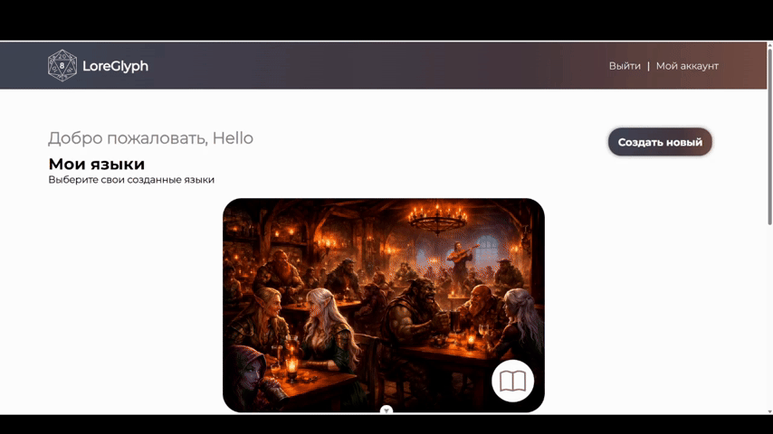
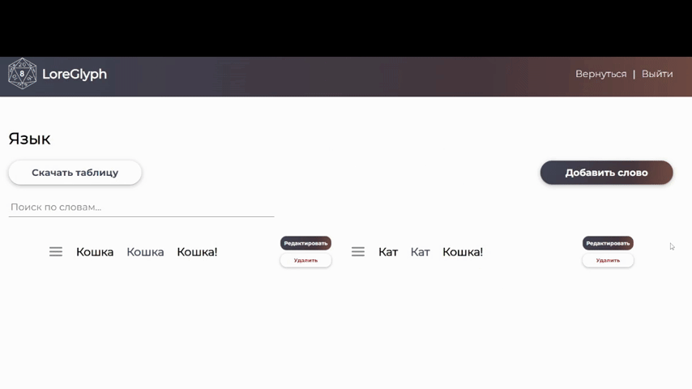
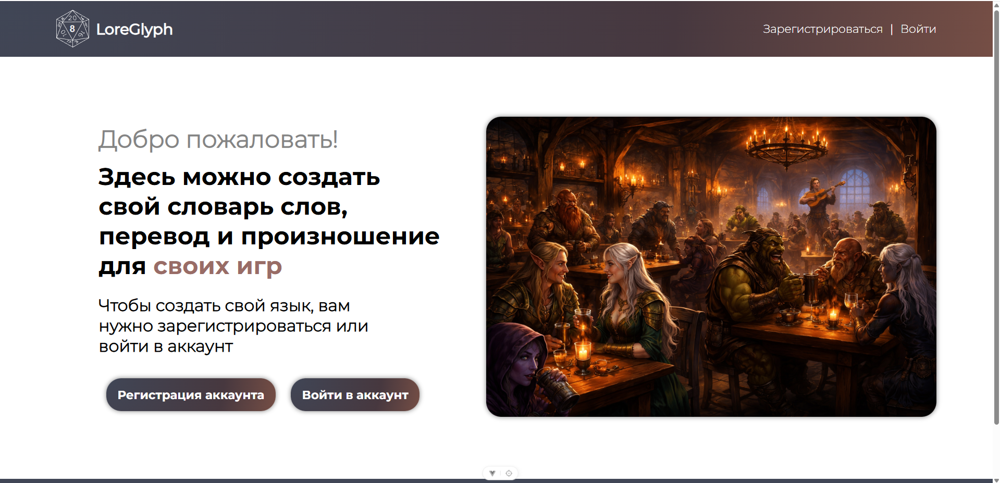
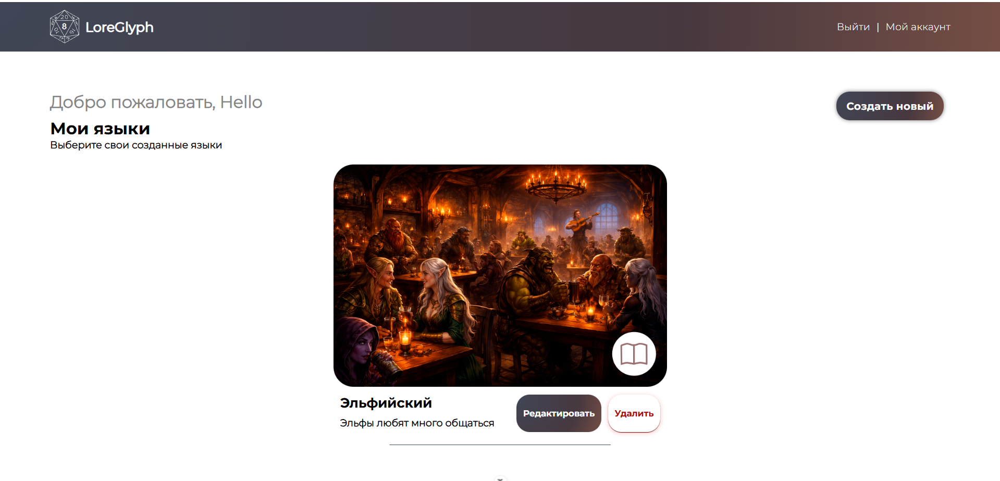
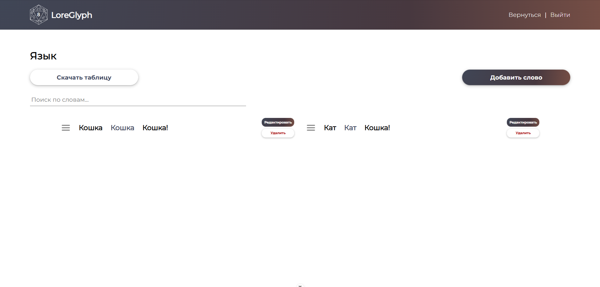
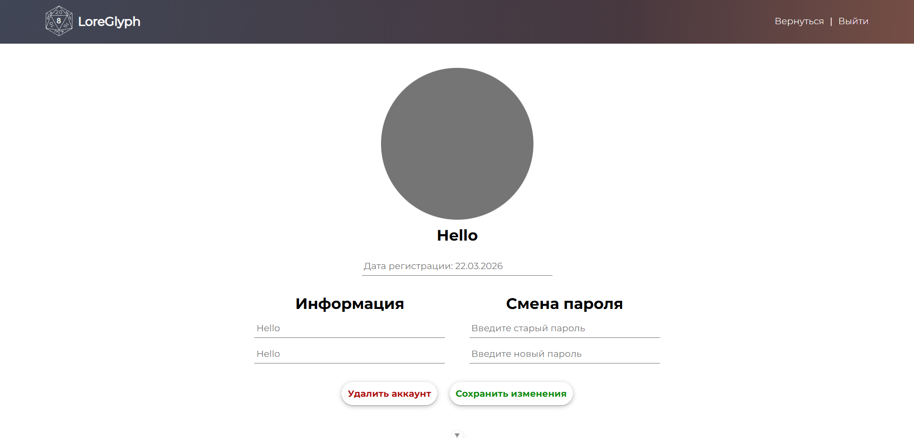

# LoreGlyph

LoreGlyph - это веб-интерфейс на ASP.Net и Vue.js с авторизацией через JWT-токен, написанный для создания своих языков, слов (включая произношение, перевод). В веб-интерфейсе также включена возможность скачать таблицу-эксель для своего языка, где будет экспорт слов, их транскрипций и переводов.

Дизайн проекта на Figma: https://www.figma.com/design/H3uFolCn28lYjome5kyyPj/LoreGlyph?node-id=0-1&t=bzJtXByKebGMmsrM-1

### Стек и библиотеки
1. ASP.Net,
2. POSTGRESQL
3. Vue.JS
4. SortableJS - библиотека для сортировки и drag&drop элементов (слов)
5. SheetJS - библиотека для экспорта и импорта таблиц Excel
6. Toastification - Библиотека для всплывающих уведомлений

## Что умеет приложение?
Аутентификация реализована через JWT: пользователь логинится, и ASP.NET backend возвращает токен. Frontend на Vue.js сохраняет его (localstorage) и отправляет в заголовке Authorization: Bearer. Сервер проверяет токен и даёт доступ к защищённым эндпоинтам. Если токен потух, то пользователь автоматически будет переадресован на главную страницу /home (все страницы защищены от анонимов и в случае потухшего токена или его отсутствия, переадресация на home), где ему будет предложено - зарегистрироваться, сбросить пароль с помощью логина и кодового слова (которое пользователь создает себе сам) или залогиниться.

У каждого пользователя свои языки, у каждого языка пользователь создает слова. 

Пользователь может создавать слова, а также экспортировать таблицу слов.

## Интерфейс
* Главная страница

* Меню языков

* Слова

* Аккаунт

## Запуск
> [!NOTE]
> Используется DockerCompose
> Вам нужно создать .env файл и ввести такого вида запись:
> * POSTGRES_PASSWORD=(придумайте пароль)
> * DB_CONNECTION_STRING=Host=postgres;Database=db;Username=postgres;Password=(придумайте пароль)
> * JWT_KEY=(ключ должен состоять больше 32 символов)
> * JWT_ISSUER=LoreGlyphDocker
> * JWT_AUDIENCE=LoreGlyphUsers
> * VUE_APP_API_URL=http://loreglyph:8080/api
> * Тогда приложение будет доступно на 8000 порту

Устаревшее:
1. Установите PostgreSQL, Node.Js, .NET SDK 10, (опционально) Vue CLI или Vite
2. Настроить секреты:
* dotnet user-secrets init
* dotnet user-secrets set "ConnectionStrings:DefaultConnection" "Host=localhost;Database=mydb;Username=postgres;Password=your_password"
* dotnet user-secrets set "Jwt:Key" "your_super_secret_key_123"
* dotnet user-secrets set "Jwt:Issuer" "LoreGlyph"
* dotnet user-secrets set "Jwt:Audience" "LoreGlyphUsers"

3. Применить миграции:

dotnet ef database update

5. Запустить проект

dotnet run

6. Запустить фронтенд
* cd client
* npm install
* npm run dev

Приложение запускается на порте:
- http://localhost:5248

## Что планируется ввести?
1. Добавление аватарок, смена обложки языка
2. Функция делиться языком по ссылке
3. Добавление правописания слова с помощью графики (пользователь может рисовать символы)
4. Совместное редактирование слов по ссылке
5. Локализация на английском

Created by Springlezz (https://github.com/Springlezz)
